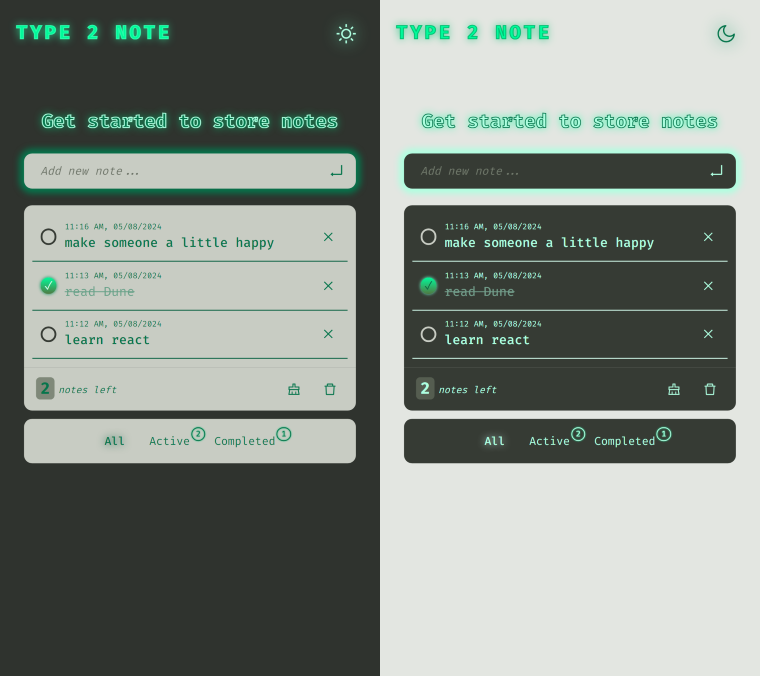

# Type 2 Note App implemented with React, Vite, Redux, Styled Components, React Hot Toaster and Reduxjs/toolkit

### Getting Started

To get started with this project, you will need to have Node.js and Vite installed on your machine.

To install Node.js, visit the Node.js website: [node](https://nodejs.org)

To install Vite, run the following command in your terminal:

```
npm install -g vite
```

Once you have Node.js and Vite installed, you can clone the **type2note** repository to your local machine:

```
git clone https://github.com/bakna2t/type2note.git
```

Navigate to the type2note directory and install the dependencies:

```
cd type2note
npm install
```

To start the development server, run the following command:

```
npm run dev
```

The development server will be running on http://localhost:5173. You can open this URL in your web browser to view the type2note app.

#### Developed with:

- [React](https://reactjs.org/)
- [Vite](https://vitejs.dev/)
- [Styled Components](https://styled-components.com/)
- [React Hot Toast](https://react-hot-toast.com/)
- [Redux Toolkit](https://redux-toolkit.js.org/)
- [Ant Design/icons](https://ant.design/components/icon/)

click here to visit => [_**Type2Note**_](https://type2note.vercel.app/)

<div align="center">
    <p style="width: 500px;">
        <a href="https://type2note.vercel.app/" target="_blank" >
            
        </a>
    </p>
</div>
